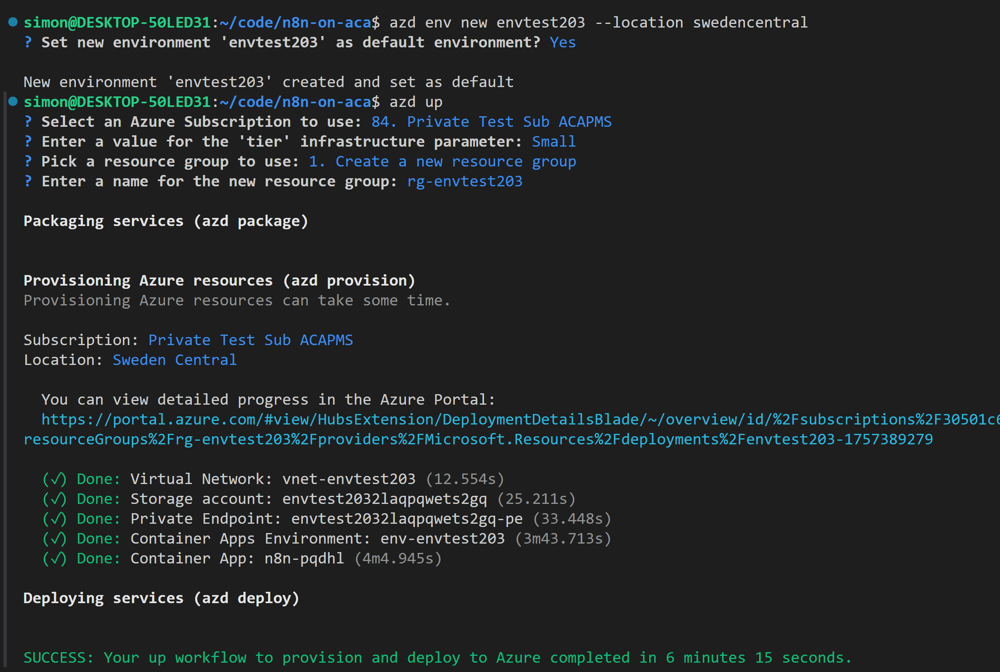
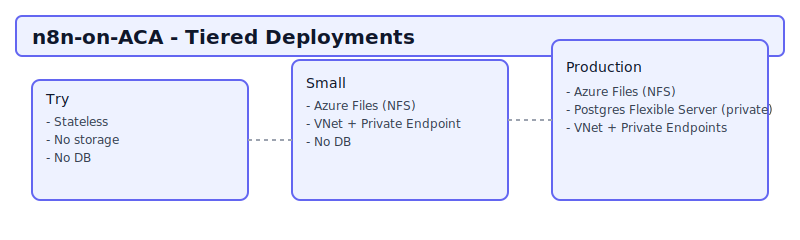

# n8n on Azure Container Apps (Tiered Deployment)



This project provides an Azure Developer CLI (azd) based deployment of [n8n](https://n8n.io) to Azure Container Apps with three selectable tiers. You choose the tier interactively when running `azd up` (works on Windows, macOS, and Linux), or you can preconfigure it via `azd config`.


## Tiers Overview


| Tier | Purpose | Persistence | Postgres | Private Networking |
|------|---------|-------------|----------|--------------------|
| Try | Fast stateless trial | None | No | No (public ACA env) |
| Small | Cheapest persistent | Azure Files share | No | VNet + Private Endpoint (storage) |
| Production | Durable + DB | Azure Files share | Yes (Private Flexible Server) | VNet + Private Endpoints (storage & Postgres) |


## Prerequisites
- Install Azure Developer CLI (azd): https://learn.microsoft.com/azure/developer/azure-developer-cli/install-azd
- Azure Developer CLI logged in: `azd auth login`
- This repository cloned locally and you are in its root directory
- An Azure subscription


## Deployment Instructions
Deploying with `azd` is easy as creating an environment, choosing your deployment details and letting things finish.

```bash
cd n8n-on-aca

# create a new azd environment to keep track of this deployment (azd env list)
azd env new myn8n-instance

# start the deployment
azd up
```


## Key Environment Variables
Set these with `azd env set <KEY> <VALUE>` after creating an azd environment. These are optional helpers; azd will also prompt you interactively for anything missing.

| Variable | Description | Example |
|----------|-------------|---------|
| `AZURE_LOCATION` | Azure region (Production Postgres may require allowed region) | `westeurope` |
| `AZURE_RESOURCE_GROUP` | (Optional) Explicit RG name (azd will create if not exists) | `n8n-demo-rg` |
| `POSTGRES_ADMIN_PASSWORD` | (Prod only) Admin password for Postgres flexible server | generated via `openssl` |
| `ACA_ENVIRONMENT_NAME` | (Try only optional) Reuse existing ACA managed environment | `aca-shared-env` |

Tier selection is prompted at deploy time; you’ll see a menu for `Try | Small | Production`.


## Notes
- A few environment variables still need to be optimized across all deployment tiers.
- PostgresDB currently does not verify the SSL cert as part of making the connection (DB_POSTGRESDB_SSL_REJECT_UNAUTHORIZED=false).
- Improvments via PRs are very welcome.